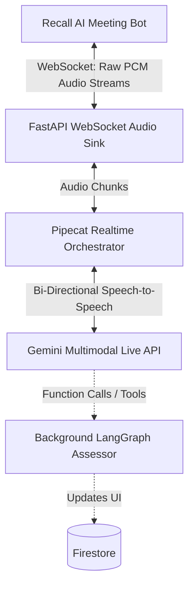

# AI Voice Enhancement Plan: Integrating Gemini Live API

## Executive Summary
The prevailing architecture relies on a traditional STT -> LLM -> TTS "turn-based" pipeline driven by Recall AI webhooks. Because it processes text rather than native audio, the end result feels highly "AI generated"—it is prone to latency, ignores conversational interruptions, and uses standard text-to-speech generators. 

To meet the CEO's expectations for a purely human-like conversation, we must transition to a **Speech-to-Speech** methodology utilizing the **Gemini Multimodal Live API** (or equivalent Realtime API).

This plan analyzes the problem, proposes a multi-phased solution, and outlines the exact proceedings required to implement the new architecture.

---

## Technical Analysis of Current System

**The Bottlenecks:**
1. **Webhook Lag:** `transcript.data` webhooks only arrive *after* the human finishes speaking and Recall processes the STT. This adds ~1.5 - 2 seconds natively.
2. **Turn-Based Pipeline:** LangGraph orchestrates the logic via purely text means. The model (`gemini-2.5-flash-tts`) subsequently reads the text with flat inflexion.
3. **No Interruption Handling:** Because the bot sends monolithic MP3 chunks to the meeting via `send_audio`, it cannot gracefully stop speaking if the user interrupts.

---

## Proposed Solution & Architecture

To achieve the "Gemini Live" paradigm, we must abandon the `transcript -> Langgraph -> TTS` pattern for the core conversational loop and establish a direct WebSocket stream of raw audio between Recall AI and Gemini Multimodal Live.

### New Real-Time Audio Data Flow:

---

## Proceedings (Step-by-Step Action Plan)

To de-risk the transition while delivering immediate value to stakeholders, I propose a two-phased approach.

### Phase 1: The Tactical Quick-Fix (Days 1-2)
Before rewriting the entire audio engine, we can instantly elevate the voice quality by switching the underlying Text-to-Speech engine in Pipecat.
- **Action:** Switch `TTS_PROVIDER` to `cartesia` (Cartesia.ai's Sonic model). 
- **Result:** Cartesia delivers the most expressive, emotive human voice on the market. The architecture remains the same (webhook-driven), but the output immediately sounds like a real person to stakeholders.

### Phase 2: The Gemini Live Realitime Overhaul (Week 1-2)
This establishes the ultra-low latency, interruptible, conversational system.

1. **Recall AI Media Configuration:** 
   - Modify `python/services/recall_api.py` to open a real-time `websocket` endpoint stream instead of standard webhooks. This instructs Recall to stream raw 16-bit PCM audio directly to the Python backend.
   
2. **Develop the Audio Transport Layer:**
   - Create a new FastAPI WebSocket route (e.g., `/ws/audio/recall`) to ingest incoming audio frames from the interview and multiplex outgoing audio frames back to the Recall audio player mechanism.
   
3. **Pipecat Gemini Multimodal Initialization:**
   - Replace the static text-based `InterviewPipeline` orchestrator with Pipecat’s `GeminiMultimodalLiveService`. 
   - The Pipecat engine will act as the "glue" connecting our custom Recall Audio Transport to Gemini Live's bidirectional socket.
   
4. **Tool Calling & Interview State:**
   - **Challenge:** We lose LangGraph's explicit stage-by-stage conversational prompts because Gemini controls the speech.
   - **Solution:** We will migrate the Langgraph intelligence into Gemini's **Function Calling** capabilities. We provide the Gemini Live instance with tools (e.g., `progress_to_next_question()`, `evaluate_current_answer()`). Gemini orchestrates the audio while firing asynchronous tool webhooks to our backend to update the visual UI and state.

---

## Recommendation & Next Steps
We should initiate **Phase 1** (TTS provider swap) right now if an immediate demo is required. Then, I can begin rewriting the backend to establish the continuous audio WebSocket link for **Phase 2** (Gemini Live). 

**Please review this plan. If you approve, let me know if you would like me to immediately configure a Cartesia/ElevenLabs fallback block, or if we should jump straight into re-architecting the Recall audio websockets for true Gemini Live!**
